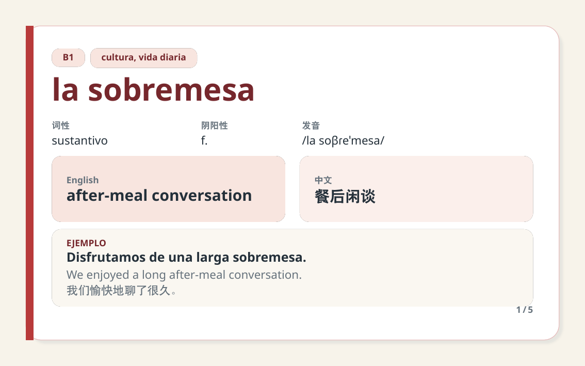

# SpanishCards

SpanishCards 是一个使用 LuaLaTeX 编写的西班牙语词汇学习模块，面向电脑和平板阅读。它以一页一词的彩色卡片为主要形式，同时提供三语总览表格、记忆测验模式、CSV/JSON 运行时导入，以及 JSON 预生成 TeX 工作流。



## 目录

- [功能总览](#功能总览)
- [环境要求](#环境要求)
- [安装方式](#安装方式)
- [快速开始](#快速开始)
- [数据工作流选择](#数据工作流选择)
- [手工添加词条](#手工添加词条)
- [CSV 运行时导入](#csv-运行时导入)
- [JSON 运行时导入](#json-运行时导入)
- [JSON 预生成 TeX](#json-预生成-tex)
- [Makefile 使用方法](#makefile-使用方法)
- [卡片与表格输出](#卡片与表格输出)
- [正文课程板块](#正文课程板块)
- [记忆与测验模式](#记忆与测验模式)
- [颜色主题](#颜色主题)
- [字段参考](#字段参考)
- [项目结构](#项目结构)
- [测试与验证](#测试与验证)
- [清理构建文件](#清理构建文件)
- [常见问题](#常见问题)
- [当前限制](#当前限制)
- [西语键盘安装与输入教程](#西语键盘安装与输入教程)

## 功能总览

| 功能 | 支持情况 | 说明 |
|---|---:|---|
| 西语—英语—中文 | ✓ | 卡片和表格均支持三语显示 |
| 词性与阴阳性 | ✓ | 空字段自动省略 |
| IPA/发音提示 | ✓ | 使用支持 IPA 的专用字体 |
| 三语例句 | ✓ | 西语例句及英中翻译 |
| 一页一词卡片 | ✓ | 默认 160 mm × 100 mm，16:10 |
| 三语总览表格 | ✓ | 支持自动分页和重复表头 |
| 正文课程板块 | ✓ | 支持入门讲解、提示、例句和练习页 |
| 测验模式 | ✓ | 隐藏英文、中文或例句翻译 |
| 手工词条 | ✓ | 使用 `\AddSpanishWord` |
| CSV 运行时导入 | ✓ | 编译期间直接读取 CSV |
| JSON 运行时导入 | ✓ | 编译期间直接读取 JSON |
| JSON 预生成 TeX | ✓ | 可生成 `\input` 片段或完整文档 |
| Make 自动化 | ✓ | 测试、构建、批量转换和清理 |
| 音频与间隔重复 | — | 当前版本未实现 |

## 环境要求

必须使用 LuaLaTeX。pdfLaTeX 和 XeLaTeX 不支持本项目的直接 JSON 解析路径。

推荐环境：

- TeX Live 2025 或更新版本。
- `lualatex`。
- `texlua`。
- `latexmk`，用于 `make pdf`。
- GNU Make 或兼容的 `make`。

测试脚本还会使用：

- `pdftotext`
- `pdfinfo`
- `rg`（ripgrep）
- `sha256sum`

主要 LaTeX 宏包由 TeX Live 提供，包括 `ctex`、`tcolorbox`、`longtable`、`booktabs`、`xcolor` 和 `fontspec`。

## 安装方式

### 方式一：放在项目目录中

最简单的方式是让以下三个文件与主 `.tex` 文件位于同一目录：

```text
spanishcards.cls
spanishcards.sty
spanishcards-data.lua
```

JSON 预生成工具还需要：

```text
scripts/json-to-tex.lua
```

### 方式二：安装到本地 TeX 树

查看个人 TeX 树位置：

```bash
kpsewhich -var-value=TEXMFHOME
```

可将三个运行时模块放入类似目录：

```text
~/texmf/tex/latex/spanishcards/
```

随后执行：

```bash
mktexlsr ~/texmf
```

转换脚本和 Makefile 通常保留在具体词库项目中，不必安装到 TeX 树。

## 快速开始

创建 `my-vocabulary.tex`：

```latex
\documentclass{spanishcards}

\SpanishCardsSetup{
  theme = mediterranean,
  mode = study,
  answer-style = lines,
  show-card-number = true
}

\begin{document}

\SpanishLessonTitle{
  title = {西班牙语入门},
  subtitle = {字母、发音与基本问候},
  goal = {先理解基础知识，再用词卡记忆核心词汇}
}

\begin{SpanishTheoryBlock}{西班牙语是什么}
西班牙语使用拉丁字母。入门阶段需要熟悉 ñ、重音元音
á、é、í、ó、ú，以及倒问号和倒感叹号。
\end{SpanishTheoryBlock}

\begin{SpanishExampleBlock}{基础问候}
\SpanishExampleLine{Hola.}{Hello.}{你好。}
\SpanishExampleLine{Buenos días.}{Good morning.}{早上好。}
\end{SpanishExampleBlock}

\AddSpanishWord{
  spanish = {la estación},
  english = {station},
  chinese = {车站},
  pos = {sustantivo},
  gender = {f.},
  pronunciation = {/la es.taˈsjon/},
  example-es = {La estación está cerca.},
  example-en = {The station is nearby.},
  example-zh = {车站就在附近。},
  level = {A1},
  tags = {{viajes, ciudad}},
  color = {ocean}
}

\PrintVocabularyCards

\end{document}
```

编译：

```bash
lualatex my-vocabulary.tex
```

仓库中的完整示例可以直接通过 Make 编译：

```bash
make pdf
```

生成结果为根目录下的 `example.pdf`。

## 数据工作流选择

| 工作流 | 命令/接口 | 适用场景 |
|---|---|---|
| 手工录入 | `\AddSpanishWord{...}` | 少量词条、需要 LaTeX 格式命令 |
| CSV 运行时导入 | `\LoadSpanishCSV{...}` | 表格软件维护词库、编译时读取 |
| JSON 运行时导入 | `\LoadSpanishJSON{...}` | 程序生成数据、希望保持单一 JSON 源 |
| JSON → TeX 片段 | `make json-fragments` | 希望检查生成内容并用 `\input` 引入 |
| JSON → 完整文档 | `FORMAT=document` | 希望得到可独立编译的 `.tex` 文档 |

运行时导入最方便；预生成 TeX 更适合发布、审查、缓存或不希望文档编译阶段读取 JSON 的场景。

## 手工添加词条

```latex
\AddSpanishWord{
  spanish = {el libro},
  english = {book},
  chinese = {书},
  pos = {sustantivo},
  gender = {m.},
  pronunciation = {/el ˈliβɾo/},
  example-es = {Estoy leyendo un libro.},
  example-en = {I am reading a book.},
  example-zh = {我正在读一本书。},
  level = {A1},
  tags = {{objetos, estudio}},
  color = {mint}
}
```

LaTeX 手工接口使用 `example-es`、`example-en` 和 `example-zh` 形式的连字符键。

如果字段值中含有逗号，而逗号可能被键值解析器理解为分隔符，请增加一层花括号：

```latex
tags = {{viajes, ciudad}}
```

手工接口允许在字段值中使用受控的 LaTeX 格式命令。外部 CSV/JSON 数据则始终按纯文本转义。

## CSV 运行时导入

在文档中调用：

```latex
\LoadSpanishCSV{data/example.csv}
\PrintVocabularyCards
```

CSV 必须使用 UTF-8，第一行是字段名：

```csv
spanish,english,chinese,pos,gender,pronunciation,example_es,example_en,example_zh,level,tags,color
la estación,station,车站,sustantivo,f.,/la es.taˈsjon/,La estación está cerca.,The station is nearby.,车站就在附近。,A1,"viajes, ciudad",ocean
```

CSV 解析器支持：

- 双引号字段。
- 双引号内的逗号。
- 双引号内的换行。
- 用两个连续双引号表示字面双引号。
- LF 与 CRLF 换行。
- 任意字段顺序。

未知列会被忽略并产生警告。

## JSON 运行时导入

在文档中调用：

```latex
\LoadSpanishJSON{data/example.json}
\PrintVocabularyCards
```

JSON 根节点必须是对象数组：

```json
[
  {
    "spanish": "la estación",
    "english": "station",
    "chinese": "车站",
    "pos": "sustantivo",
    "gender": "f.",
    "pronunciation": "/la es.taˈsjon/",
    "example_es": "La estación está cerca.",
    "example_en": "The station is nearby.",
    "example_zh": "车站就在附近。",
    "level": "A1",
    "tags": "viajes, ciudad",
    "color": "ocean"
  }
]
```

字符串、数字、布尔值和 `null` 均可读取。数字和布尔值转换为文本，`null` 转换为空字段。嵌套对象或数组不能作为词条字段值。

## JSON 预生成 TeX

预生成转换器位于：

```text
scripts/json-to-tex.lua
```

它与运行时 JSON 导入共用 `spanishcards-data.lua` 中的解析、字段映射和 TeX 转义逻辑，不会产生两套不一致的数据规则。

### 生成可由 `\input` 使用的片段

```bash
make convert-json \
  INPUT=data/example.json \
  OUTPUT=generated/custom.tex \
  FORMAT=fragment \
  VIEW=cards
```

也可以直接调用底层脚本：

```bash
texlua scripts/json-to-tex.lua \
  --input data/example.json \
  --output generated/custom.tex \
  --format fragment
```

生成内容类似：

```latex
% Generated by SpanishCards. Do not edit manually.
% Source: data/example.json

\AddSpanishWord{spanish={acogedor},english={cozy},...}
\AddSpanishWord{spanish={aprovechar},english={to make the most of},...}
```

在主文档中使用：

```latex
\documentclass{spanishcards}

\begin{document}
\input{generated/custom.tex}
\PrintVocabularyCards
\end{document}
```

### 生成完整卡片文档

```bash
make convert-json \
  INPUT=data/example.json \
  OUTPUT=generated/example-cards.tex \
  FORMAT=document \
  VIEW=cards
```

生成文件包含：

- `\documentclass{spanishcards}`
- 所有 `\AddSpanishWord` 命令
- `\PrintVocabularyCards`
- 完整的 `document` 环境

### 生成完整表格文档

```bash
make convert-json \
  INPUT=data/example.json \
  OUTPUT=generated/example-table.tex \
  FORMAT=document \
  VIEW=table
```

表格文档使用 `\PrintVocabularyTable`。

编译生成文档时，确保 SpanishCards 模块可由 TeX 找到：

```bash
mkdir -p build/generated
lualatex \
  -output-directory=build/generated \
  generated/example-table.tex
```

### 批量生成

将所有 `data/*.json` 生成片段：

```bash
make json-fragments
```

输出路径：

```text
generated/fragments/<JSON 文件名>.tex
```

将所有 `data/*.json` 生成完整卡片文档：

```bash
make json-documents
```

输出路径：

```text
generated/documents/<JSON 文件名>.tex
```

批量完整文档默认使用卡片视图。需要表格视图时使用 `make convert-json ... VIEW=table`。

### 转换器选项

```bash
texlua scripts/json-to-tex.lua --help
```

| 选项 | 是否必填 | 值 |
|---|---:|---|
| `--input` | 是 | 输入 JSON 文件 |
| `--output` | 是 | 输出 `.tex` 文件 |
| `--format` | 否 | `fragment` 或 `document`，默认 `fragment` |
| `--view` | 否 | `cards` 或 `table`，默认 `cards` |
| `--help` | 否 | 显示帮助 |

转换器会自动创建输出目录，并先写临时文件再替换目标文件。输出不包含时间戳，因此相同输入可以得到稳定的文件内容。

## Makefile 使用方法

查看所有命令：

```bash
make help
```

### Make 目标

| 目标 | 作用 |
|---|---|
| `make help` | 显示目标、变量和默认值 |
| `make test` | 运行全部自动测试 |
| `make pdf` | 编译 `example.tex` 并更新 `example.pdf` |
| `make convert-json` | 转换单个 JSON 文件 |
| `make json-fragments` | 批量生成 `\input` 片段 |
| `make json-documents` | 批量生成完整卡片文档 |
| `make clean` | 删除构建缓存、生成 TeX 和辅助文件 |
| `make distclean` | 在 `clean` 基础上删除 `example.pdf` |

### Make 变量

| 变量 | 默认值 | 用途 |
|---|---|---|
| `INPUT` | `data/example.json` | 单文件转换输入 |
| `OUTPUT` | `generated/custom.tex` | 单文件转换输出 |
| `FORMAT` | `fragment` | `fragment` 或 `document` |
| `VIEW` | `cards` | `cards` 或 `table` |
| `TEXLUA` | `texlua` | texlua 命令 |
| `LATEXMK` | `latexmk` | latexmk 命令 |
| `TEXMFVAR` | `build/texmf-var` | TeX 可写变量缓存 |
| `TEXMFCACHE` | `build/texmf-cache` | Lua 字体缓存 |

完整单文件示例：

```bash
make convert-json \
  INPUT=data/example.json \
  OUTPUT=generated/example-table.tex \
  FORMAT=document \
  VIEW=table
```

变量也可以通过环境覆盖：

```bash
LATEXMK=/custom/path/latexmk make pdf
```

## 卡片与表格输出

载入数据后可以选择任意输出方式：

```latex
\PrintVocabularyCards
\PrintVocabularyTable
```

- `\PrintVocabularyCards`：一页一词的彩色卡片。
- `\PrintVocabularyTable`：可跨页的三语总览表格。
- 打印命令不会消费词库，因此同一数据可以先输出卡片，再输出表格。
- `\ClearSpanishWords` 清空当前词库。
- 如果前面已经写了正文课程板块，`\PrintVocabularyCards` 会从新页开始输出词卡。

示例：

```latex
\LoadSpanishJSON{data/example.json}
\PrintVocabularyCards

\SpanishCardsSetup{mode=quiz-english}
\PrintVocabularyTable
```

## 正文课程板块

除了词卡和表格，SpanishCards 也可以写教材式正文。适合放入西语入门知识、发音说明、键盘输入提示、语法规则、三语例句和练习题。正文板块是普通 LaTeX 内容，可以和 `\PrintVocabularyCards` 穿插使用。

标题页：

```latex
\SpanishLessonTitle{
  title = {西班牙语入门},
  subtitle = {字母、发音与基本问候},
  goal = {认识西语基础字符、问候句和正文学习板块}
}
```

常用正文板块：

```latex
\begin{SpanishTheoryBlock}{西班牙语是什么}
西班牙语属于罗曼语族，使用拉丁字母书写。初学时最需要熟悉的是
ñ、重音元音以及倒问号和倒感叹号。
\end{SpanishTheoryBlock}

\begin{SpanishTipBlock}{输入提示}
切换到 Spanish (Spain) 键盘后，标准美式键盘上的分号键可以输入 ñ。
\end{SpanishTipBlock}

\begin{SpanishNoteBlock}{发音提醒}
西语单词通常按照书写形式发音，重音符号会提示读音重心。
\end{SpanishNoteBlock}

\begin{SpanishExampleBlock}{基础问候}
\SpanishExampleLine{Hola.}{Hello.}{你好。}
\SpanishExampleLine{Buenos días.}{Good morning.}{早上好。}
\end{SpanishExampleBlock}

\begin{SpanishPracticeBlock}{小练习}
请写出 Hola、gracias、adiós 的中文意思，并尝试读出每个词。
\end{SpanishPracticeBlock}
```

可用接口：

| 命令或环境 | 用途 |
|---|---|
| `\SpanishLessonTitle{...}` | 课程标题页，支持 `title`、`subtitle`、`goal` |
| `SpanishTheoryBlock` | 正文讲解，例如西语基础知识、语法说明 |
| `SpanishTipBlock` | 技巧提示，例如键盘输入、学习方法 |
| `SpanishNoteBlock` | 补充说明，例如发音提醒、易错点 |
| `SpanishExampleBlock` | 例句板块 |
| `SpanishPracticeBlock` | 练习题或自测任务 |
| `\SpanishExampleLine{西语}{English}{中文}` | 三语例句行 |

默认页面仍是 160 mm × 100 mm 的横版屏幕尺寸。较长正文建议拆成多个短段落或多个板块；如果要写完整教材章节，可以用普通文档类加载 `spanishcards.sty`，见“单独使用样式包”。

## 记忆与测验模式

全局设置：

```latex
\SpanishCardsSetup{
  mode = recall,
  answer-style = lines,
  hide = {},
  show-card-number = true
}
```

| 模式 | 自动隐藏字段 |
|---|---|
| `study` | 不隐藏 |
| `recall` | 英文、中文、英文例句翻译、中文例句翻译 |
| `quiz-english` | 英文及英文例句翻译 |
| `quiz-chinese` | 中文及中文例句翻译 |
| `quiz-examples` | 英文和中文例句翻译 |
| `custom` | 使用 `hide` 指定 |

答案样式：

- `answer-style=hidden`：保留基本区域但不显示文本。
- `answer-style=lines`：使用答题横线。

自定义隐藏：

```latex
\SpanishCardsSetup{
  mode = custom,
  hide = {english,chinese,example-en},
  answer-style = lines
}
```

被隐藏的答案不会写入 PDF 文本层。

## 颜色主题

内置主题：

- `mediterranean`
- `ocean`
- `mint`
- `sunset`

设置全局主题：

```latex
\SpanishCardsSetup{theme=mint}
```

覆盖单张卡片主题：

```latex
\AddSpanishWord{
  spanish = {el mar},
  english = {sea},
  chinese = {海},
  color = {ocean}
}
```

## 字段参考

| LaTeX 手工键 | CSV/JSON 键 | 必填 | 含义 |
|---|---|---:|---|
| `spanish` | `spanish` | 是 | 西班牙语词条 |
| `english` | `english` | 否 | 英文翻译 |
| `chinese` | `chinese` | 否 | 中文翻译 |
| `pos` | `pos` | 否 | 词性 |
| `gender` | `gender` | 否 | 阴阳性 |
| `pronunciation` | `pronunciation` | 否 | IPA 或发音提示 |
| `example-es` | `example_es` | 否 | 西语例句 |
| `example-en` | `example_en` | 否 | 英文例句翻译 |
| `example-zh` | `example_zh` | 否 | 中文例句翻译 |
| `level` | `level` | 否 | CEFR 等级或自定义等级 |
| `tags` | `tags` | 否 | 主题标签 |
| `color` | `color` | 否 | 单词卡主题覆盖值 |

只有 `spanish` 是结构性必填字段。缺少该字段的记录会被跳过并产生警告。

## 外部数据安全

CSV、JSON 和预生成转换器都将外部数据视为纯文本。以下 TeX 特殊字符会自动转义：

```text
\ { } $ & # % _ ^ ~
```

因此 JSON 中的文本不会被当作 LaTeX 命令执行。需要受控 LaTeX 格式时，应使用手工 `\AddSpanishWord` 接口。

## 单独使用样式包

如果不需要 16:10 页面，可以在其他文档类中加载样式包：

```latex
\documentclass{article}
\usepackage{spanishcards}

\begin{document}
\AddSpanishWord{spanish={hola},english={hello},chinese={你好}}
\PrintVocabularyCards
\end{document}
```

仍然必须使用 LuaLaTeX。卡片采用宿主文档的纸张和正文尺寸。

## 项目结构

```text
.
├── Makefile
├── README.md
├── spanishcards.cls              # 16:10 屏幕文档类
├── spanishcards.sty              # 卡片、表格、主题和测验接口
├── spanishcards-data.lua         # CSV/JSON 解析与 TeX 安全序列化
├── scripts/
│   └── json-to-tex.lua           # JSON 预生成 TeX 命令行工具
├── example.tex                   # 综合示例
├── example.pdf                   # 已编译示例
├── data/
│   ├── example.csv
│   └── example.json
├── generated/                    # make 生成，可随时重建
│   ├── fragments/
│   └── documents/
├── preview/
│   ├── page-1.png
│   └── ...
├── tests/
│   ├── fixtures/
│   ├── run-tests.sh
│   ├── test-generated-fragment.tex
│   └── test-*.tex
├── docs/superpowers/
│   ├── specs/
│   └── plans/
└── build/                        # 编译与测试缓存，可删除
```

## 测试与验证

运行全部测试：

```bash
make test
```

或直接运行：

```bash
./tests/run-tests.sh all
```

只测试转换器：

```bash
./tests/run-tests.sh converter
```

测试覆盖：

- 手工词条。
- 测验模式及 PDF 文本层隐藏。
- CSV 引号、逗号、多行和 Unicode。
- JSON Unicode、转义、数字、布尔值和 `null`。
- 卡片与表格重复渲染。
- 独立 `.sty` 使用。
- JSON → TeX 片段。
- JSON → 完整卡片文档。
- JSON → 完整表格文档。
- 转换输出确定性。
- Make 单文件和批量目标。

编译并检查示例：

```bash
make pdf
pdfinfo example.pdf
pdffonts example.pdf
```

## 清理构建文件

删除测试缓存、生成的 TeX 文件和 LaTeX 辅助文件，但保留 `example.pdf`：

```bash
make clean
```

同时删除 `example.pdf`：

```bash
make distclean
```

`generated/` 中的文件可由 JSON 随时重建，因此 `make clean` 会删除该目录。

## 常见问题

### SpanishCards requires LuaLaTeX

不要使用 `pdflatex` 或 `xelatex`。正确命令：

```bash
lualatex example.tex
```

### SpanishCards data module not found

确保 `spanishcards-data.lua` 与 `spanishcards.sty` 位于同一目录，或已安装到 TeX 可搜索路径。

检查：

```bash
kpsewhich spanishcards-data.lua
```

### 字体缓存不可写

Makefile 默认将缓存写入工作区：

```text
build/texmf-var
build/texmf-cache
```

直接运行命令时也可以手工设置：

```bash
TEXMFVAR=build/texmf-var \
TEXMFCACHE=build/texmf-cache \
lualatex example.tex
```

### JSON root is not an array

JSON 顶层必须使用方括号：

```json
[
  {"spanish": "hola", "english": "hello", "chinese": "你好"}
]
```

不能直接使用单个对象作为根节点。

### 记录被跳过

每条记录必须包含非空 `spanish`。转换器和运行时导入都会跳过缺失西语词条的记录。

### 生成文档找不到 spanishcards.cls

从包含模块文件的项目根目录编译，或将模块安装到本地 TeX 树。

### 卡片内容过长

16:10 卡片针对简短释义和单句例句设计。若词条内容很长，可缩短例句、改用表格输出，或在普通文档类中单独加载 `spanishcards.sty`。

## 当前限制

- 不包含音频播放器或在线发音查询。
- 不包含间隔重复算法和学习进度数据库。
- 不自动生成翻译、词形变化或例句。
- JSON 嵌套对象和数组不能作为词条字段值。
- 批量 `json-documents` 默认生成卡片文档；表格文档使用单文件转换并设置 `VIEW=table`。


## 西语键盘安装与输入教程

本项目建议直接在 `.tex`、CSV 和 JSON 中输入 Unicode 西语字符，例如 `ñ`、`á`、`ü`、`¿`、`¡`。LuaLaTeX 可以正常处理 UTF-8 文本，长期维护词库时比反复写 LaTeX 转义命令更直观。

如果只是偶尔输入几个字符，可以使用系统自带的符号输入、US International 键盘或 Linux Compose Key；如果会经常录入西语词条，推荐添加西班牙语键盘布局。

### 推荐布局选择

| 布局 | 适用场景 | 说明 |
|---|---|---|
| `Spanish (Spain)` / `Spanish ISO` | 欧洲西语、完整西班牙本土标点 | 下方映射表以这个布局为基准 |
| `Spanish (Latin American)` | 拉美西语输入习惯 | 字母和重音输入类似，部分标点和 `AltGr` 位置不同 |
| `United States-International` / `US International` | 不想改变大多数美式键位 | 通过死键组合输入重音和 `ñ` |

下方“键盘映射”默认场景是：实体键盘是标准美式键盘，但系统输入源已经切换到 `Spanish (Spain)`、`Spanish ISO` 或显示为 `es` 的西语布局。

### Linux 添加西语键盘

GNOME 桌面：

1. 打开 **Settings** -> **Keyboard** 或 **Region & Language**。
2. 在 **Input Sources** 中点击 **+ Add Input Source**。
3. 搜索并添加 **Spanish**，常用选择是 **Spanish** 或 **Spanish (Latin American)**。
4. 使用 **Super + Space** 切换到下一个输入源，使用 **Shift + Super + Space** 切回上一个输入源。
5. 点击顶栏输入源指示器中的 `es`，选择 **View Keyboard Layout** 可以查看当前实时键位图。

KDE Plasma 桌面：

1. 打开 **System Settings** -> **Keyboard** -> **Layouts**。
2. 启用布局配置，点击 **Add**。
3. 选择 **Spanish** 或 **Spanish (Latin American)**。
4. 在同一页面设置布局切换快捷键。

如果 GNOME 默认列表里看不到某些变体，可以打开终端执行：

```bash
gsettings set org.gnome.desktop.input-sources show-all-sources true
```

### macOS 添加西语键盘

1. 打开 **System Settings** -> **Keyboard**。
2. 在 **Text Input** 区域点击 **Edit**。
3. 点击 **+**，搜索 **Spanish**。
4. 常用选择是 **Spanish ISO** 或 **Latin American**，添加后在菜单栏输入法菜单中切换。
5. 使用 **Control + Space** 切换到上一个输入源，使用 **Control + Option + Space** 切换到下一个输入源。
6. 在输入法菜单中打开 **Show Keyboard Viewer**，可以看到当前布局在 `Shift`、`Option` 等修饰键下的实际映射。

macOS 的 `Spanish ISO`、`Spanish` 和 `Latin American` 在 `Option` 组合键上可能与 Linux/Windows 略有差异；如果符号位置不一致，以 **Keyboard Viewer** 显示为准。

### Windows 添加西语键盘

Windows 11 / Windows 10：

1. 打开 **Start** -> **Settings** -> **Time & language** -> **Language & region**。
2. 如果还没有西班牙语，先在 **Preferred languages** 中点击 **Add a language**，添加 **Spanish**。
3. 在语言右侧点击 **...** -> **Language options**。
4. 在 **Keyboards** 下点击 **Add a keyboard**。
5. 添加 **Spanish (Spain)**、**Spanish (Latin American)** 或 **United States-International**。
6. 使用 **Win + Space** 在输入源之间切换；部分环境也可以使用 **Alt + Shift**。

如果只是想保留英文键盘，但输入西语重音，Windows 上可以优先添加 **United States-International**。

### 快速输入方法

切换到 `Spanish (Spain)` / `Spanish ISO` 后，`ñ` 被直接映射到标准美式键盘的分号键位置：

| 目标字符 | 输入方法 |
|---|---|
| `ñ` | 直接按 `;` |
| `Ñ` | `Shift + ;` |
| `á é í ó ú` | 先按 `[`，松开后再按对应元音 |
| `Á É Í Ó Ú` | 先按 `[`，松开后再按 `Shift + 对应元音` |
| `ü` | 先按 `Shift + [`，松开后再按 `u` |
| `Ü` | 先按 `Shift + [`，松开后再按 `Shift + u` |
| `¡` | 直接按 `=`，也就是主键区的 `=` / `+` 键 |
| `¿` | `Shift + =`，也就是 `Shift` 加主键区的 `=` / `+` 键 |

重音键和分音键是死键：第一次按下时不会立即显示字符，按下后续元音才会组合成 `á`、`ü` 等字符。

### 常用键盘映射

以下表格以标准美式实体键盘为参照。左列写的是你手上键帽看到的按键，右侧写的是切换到西语布局后实际输入的字符。

| 美式实体键 | 直接按 | `Shift + 按键` |
|---|---|---|
| `;` | `ñ` | `Ñ` |
| `[` | 死键 `´`，用于 `á é í ó ú` | 死键 `¨`，用于 `ü` |
| `]` | 死键 grave accent，西语较少用 | 死键 `^`，西语较少用 |
| `=` | `¡` | `¿` |
| `-` | `'` | `?` |
| `/` | `-` | `_` |
| `,` | `,` | `;` |
| `.` | `.` | `:` |
| `1` | `1` | `!` |
| `2` | `2` | `"` |
| `3` | `3` | `·` |
| `4` | `4` | `$` |
| `5` | `5` | `%` |
| `6` | `6` | `&` |
| `7` | `7` | `/` |
| `8` | `8` | `(` |
| `9` | `9` | `)` |
| `0` | `0` | `=` |

### 右 Alt / AltGr 常用映射

在 Linux 和 Windows 的西语布局中，右侧 `Alt` 通常等同于 `AltGr`。按住 **右 Alt** 再按下列按键，可以输入第三层符号：

| 输入方法 | 字符 |
|---|---|
| `AltGr + 1` | `\|` |
| `AltGr + 2` | `@` |
| `AltGr + 3` | `#` |
| `AltGr + 4` | `~` |
| `AltGr + 5` | `€` |
| `AltGr + 6` | `¬` |
| `AltGr + [` | `[` |
| `AltGr + ]` | `]` |
| `AltGr + ;` | `^` |
| `AltGr + z` | `«` |
| `AltGr + x` | `»` |

在 macOS 上，第三层符号通常通过 `Option` 输入，但具体位置取决于所选输入源和实体键盘类型。建议打开 **Keyboard Viewer** 对照。

### 使用 US International 键盘

如果不想切换到完整西语键盘，可以添加 **US International**。它保留大部分美式键盘习惯，通过死键组合输入西语字符：

| 目标字符 | 输入方法 |
|---|---|
| `á é í ó ú` | 先按 `'`，再按对应元音 |
| `Á É Í Ó Ú` | 先按 `'`，再按 `Shift + 对应元音` |
| `ñ` | 先按 `~`，再按 `n` |
| `Ñ` | 先按 `~`，再按 `Shift + n` |
| `ü` | 先按 `"`，再按 `u` |
| `Ü` | 先按 `"`，再按 `Shift + u` |

US International 中 `'`、`"`、`~` 是死键。如果想输入这些符号本身，通常需要按该符号后再按空格。

### Linux Compose Key 备选方案

Linux 用户也可以设置 Compose Key，把一个不常用按键设为组合键，例如 `Caps Lock` 或右 `Alt`：

| 目标字符 | 输入方法 |
|---|---|
| `ñ` | `Compose` -> `~` -> `n` |
| `Ñ` | `Compose` -> `~` -> `N` |
| `á` | `Compose` -> `'` -> `a` |
| `ü` | `Compose` -> `"` -> `u` |
| `¿` | `Compose` -> `?` -> `?` |
| `¡` | `Compose` -> `!` -> `!` |

### 在 SpanishCards 中录入示例

推荐直接输入西语 Unicode 字符：

```latex
\AddSpanishWord{
  spanish = {la cigüeña},
  english = {stork},
  chinese = {鹳},
  pronunciation = {/la siˈɣweɲa/},
  example-es = {¿Dónde está la cigüeña? ¡Está aquí!},
  example-en = {Where is the stork? It is here!},
  example-zh = {鹳在哪里？它在这里！}
}
```

排查输入异常时，先确认当前输入源是不是 `es`，再确认添加的是 `Spanish (Spain)`、`Spanish ISO`、`Spanish (Latin American)` 还是 `US International`。如果 `;` 没有输入 `ñ`，通常是还没有切换到西语 Spain/ISO 布局，或者当前使用的是另一个布局变体。

官方参考：

- [GNOME: Use alternative keyboard layouts](https://help.gnome.org/gnome-help/keyboard-layouts.html)
- [Apple: Write in another language on Mac](https://support.apple.com/guide/mac-help/write-in-another-language-on-mac-mchlp1406/mac)
- [Microsoft: Manage language and keyboard layout settings in Windows](https://support.microsoft.com/en-us/windows/hardware/input-devices/manage-the-language-and-keyboard-input-layout-settings-in-windows)
